# アーキテクチャ

このコードベースを初めて触る開発者向けに、**どこに何があり、なぜそうなっているか**を説明します。運用は [deployment.md](deployment.md) / [operations.md](operations.md)、利用者向けは [user-guide.md](user-guide.md)、変更時に必ず守る規約は [CLAUDE.md](../CLAUDE.md) と `.claude/rules/` にあります。

## 1. 全体像

tsmyadmin は **1 プロセス**です。Bun 上の Hono が API を提供し、同じプロセスがビルド済み SPA を配信します。データベースは接続先として外部にあり、tsmyadmin 自身が持つ永続データはセッションストアだけです。

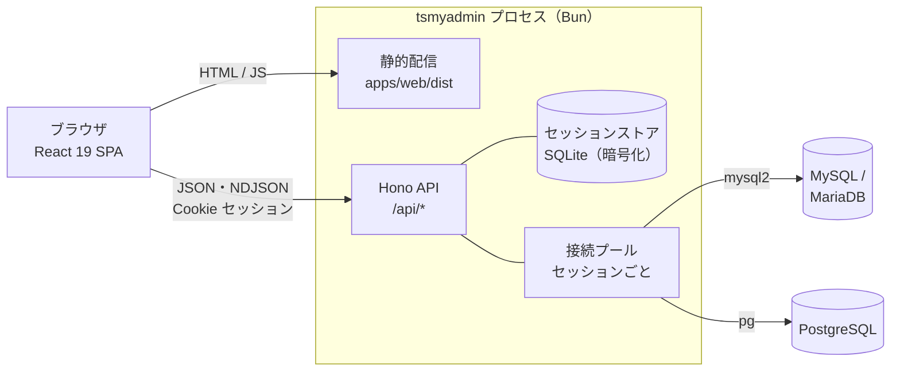

**なぜ 1 プロセスか** — 管理ツールは接続先ごとに認証情報を預かります。ブラウザに資格情報を持たせず、サーバー側セッションに閉じ込めるのが phpMyAdmin 以来の前提で、そのためには API が必要です。SPA を別ホストに置くと CORS と Cookie の設定が増えるだけなので、同一オリジンで配信します。

## 2. パッケージ構成と依存の向き

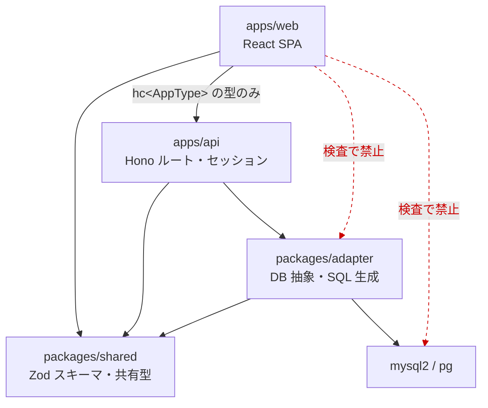

この向きは `scripts/check-architecture.mjs` が機械的に検査します（web からアダプターや DB ドライバを import すると CI が落ちます）。`packages/shared` は他の内部パッケージに依存しません。

| 層 | 責務 | 触ってよい範囲 |
|---|---|---|
| `packages/shared` | Zod スキーマ = API の契約、共有型（`Cell`、`Namespace`、`DdlOp`…）、CSV の読み書き | 依存なし |
| `packages/adapter` | `DatabaseAdapter` 契約と MySQL / PostgreSQL 実装、SQL 生成、値のワイヤー変換 | `mysql2` / `pg` はここだけ |
| `apps/api` | HTTP、セッション、監査ログ、エクスポート / インポートの組み立て | アダプター経由でのみ DB へ |
| `apps/web` | 画面。`hc<AppType>` の型でのみ API を呼ぶ | サーバー実装は型しか見ない |

## 3. アダプター層

方言差を 1 か所に閉じ込めるのがこの層の目的です。`base.ts` は方言非依存のロジック（キーセット走査、行キー解決、実行と結果整形、キャンセル管理）を持ち、方言固有の SQL は `mysql/` と `postgres/` にだけ置きます。

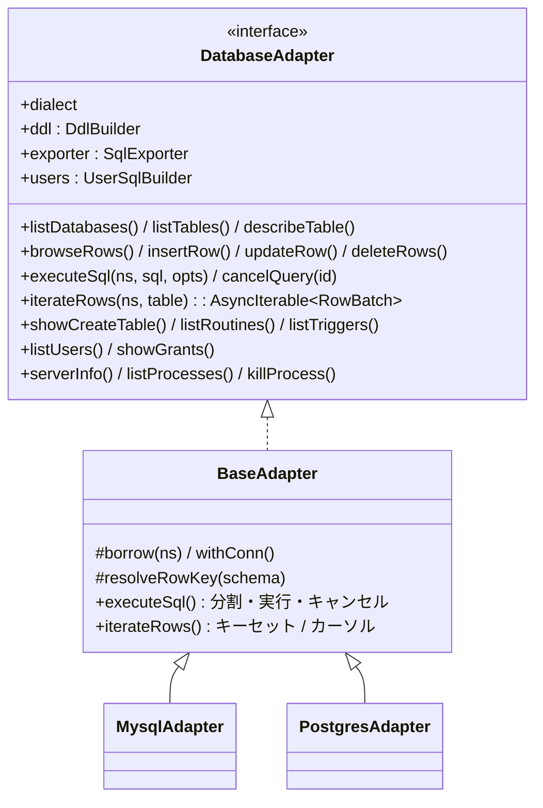

- **契約の同一性は conformance テストが保証します。** `packages/adapter/src/test/conformance.ts` は 1 つのスイートを MySQL と PostgreSQL の両方に対して実行し、`ADAPTER_METHOD_NAMES` に載ったメソッドが両方言でテストされているかを spec-consistency テストが検査します。
- **SQL の組み立て**: 識別子は `quoteIdent` / `quoteTable`、値は `Params` のプレースホルダ。文字列補間が許されるファイルは `scripts/check-sql-safety.mjs` の許可リストが唯一の正です。
- **字句解析は 1 か所**: `sql/split.ts` の `scanToken` がリテラル・コメント・方言差（`#` は MySQL のみ、PostgreSQL はブロックコメントが入れ子、`E'…'` のエスケープ、`$tag$`）を知っており、文の分割・先頭コメント除去・監査ログのマスクがすべてこれを使います。

### 値のワイヤー形式

行は `Cell[][]`（列名の重複がある JOIN 結果のため配列）で運びます。精度を落とさないことが最優先です。

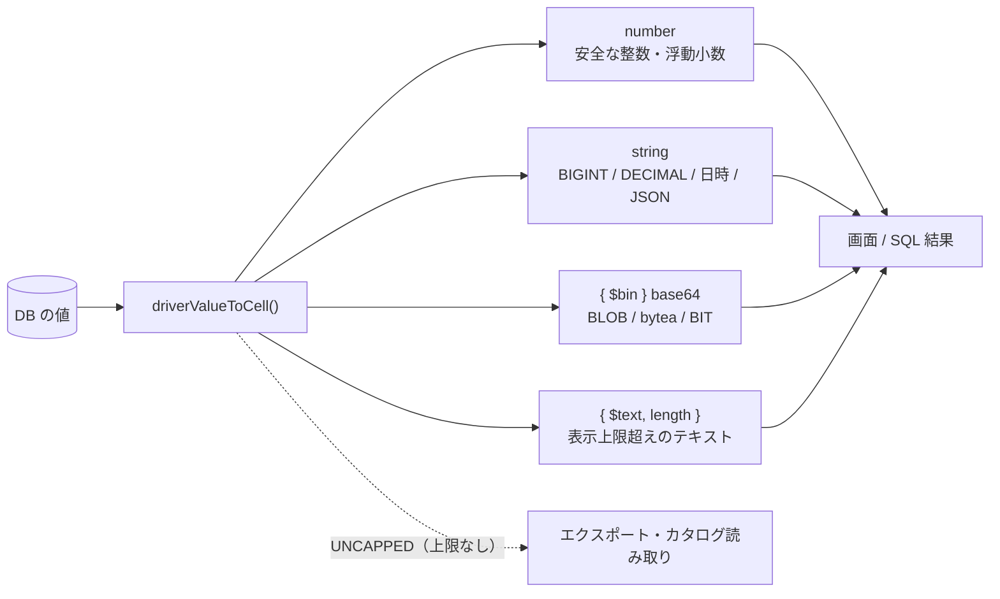

`{ $text }` は**表示専用**で、書き戻せません（`InputCell` 型が受け付けず、`toDbValue` も拒否します）。エクスポートとカタログ読み取り（ビュー定義、`SHOW CREATE`）は `UNCAPPED` で全文を取得します。

## 4. セッションと接続プール

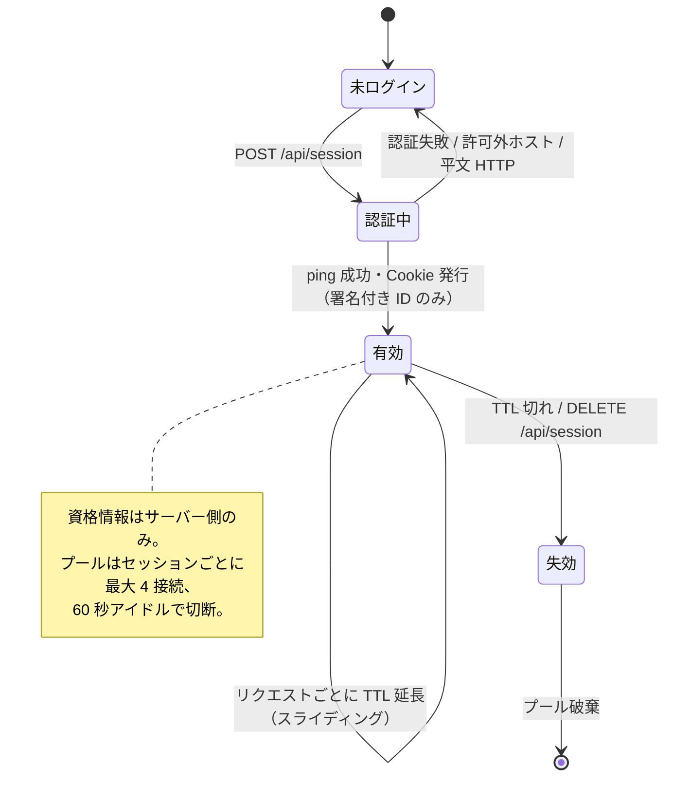

Cookie には署名付きセッション ID しか入りません。資格情報は `apps/api/src/session/store.ts`（メモリ）または `sqlite-store.ts`（`SESSION_SECRET` 由来の鍵で暗号化）にだけ置きます。

## 5. リクエストの流れ

### 5.1 行の閲覧（ふつうの GET）

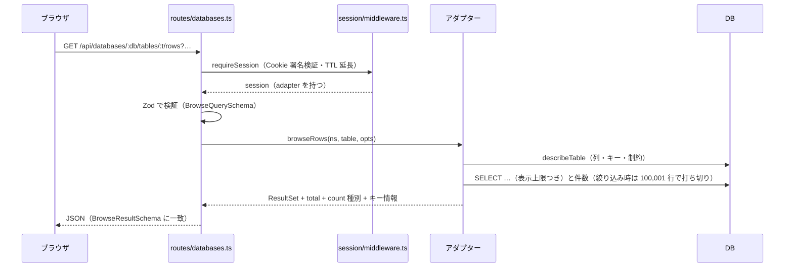

### 5.2 SQL 実行（ストリーミングとキャンセル）

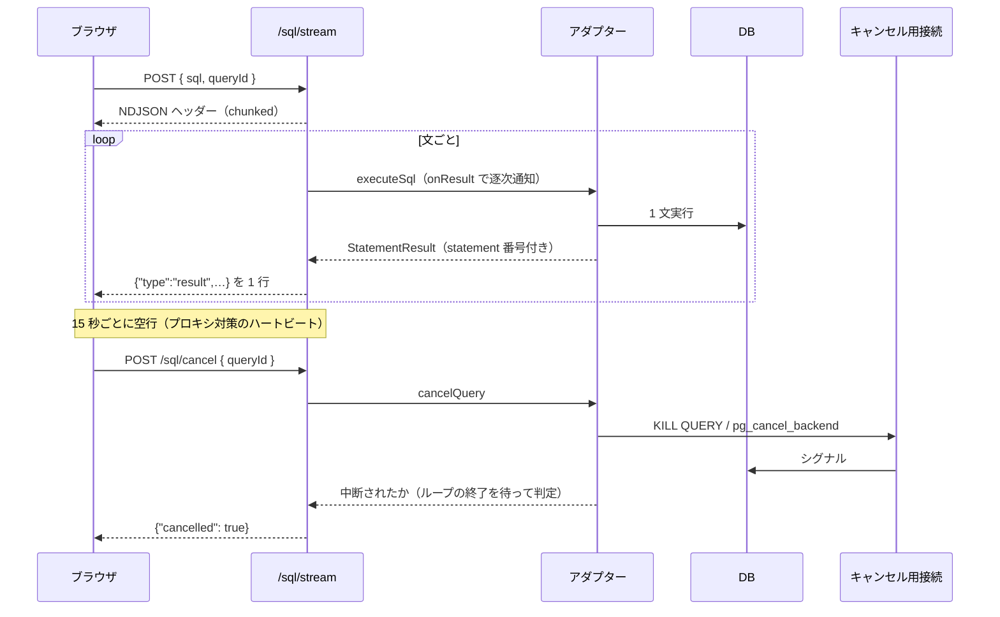

### 5.3 DDL とアカウント操作（プレビュー必須）

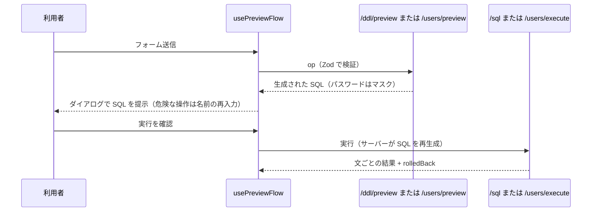

**プレビューを経ない実行 UI を作らないこと**が不変条件です（`.claude/rules/api-routes.md`）。生成した SQL をクライアントから送り返して実行することもしません（`/users/execute` はサーバー側で再生成します）。

## 6. エクスポートとインポート

エクスポートは**ストリーミング**です。1 テーブルずつカタログを読み、500 行ずつ流します。復元可能な順序が要件で、セクションの順序自体が仕様です。

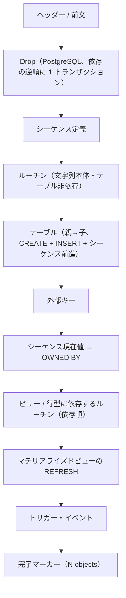

インポートは 1 回だけ字句解析し、ラッパー文を前後に足して 1 スクリプトとして実行します。

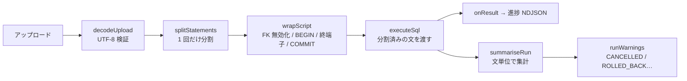

**なぜ 1 回だけ分割するか** — 64 MB のダンプを複数回トークン化するとイベントループが数百 ms 単位で止まり、他の利用者のリクエストが待たされるためです（`ExecuteOptions.statements` で分割結果をアダプターに渡します）。

## 7. 画面側

- ルーティングは TanStack Router（`apps/web/src/routes`、`routeTree.gen.ts` は生成物）。サーバー状態は TanStack Query が唯一の持ち主で、**サーバーのデータをローカル state にコピーしません**。
- `features/*` は互いを直接 import しません（共有は `components/` と `lib/`）。
- UI 文字列は `config/locales/{ja,en}.ts` にのみ置き、`locale.*` で参照します。`en.ts` は `satisfies Locale` で日本語版と同じ形であることが型で保証されます。
- 表示言語は「利用者の選択 → ブラウザ言語 → 日本語」の順に決まり、切り替え時はページを再読み込みします（各モジュールが読み込み時に一度だけ `locale` を読むため）。

## 8. 品質ゲート

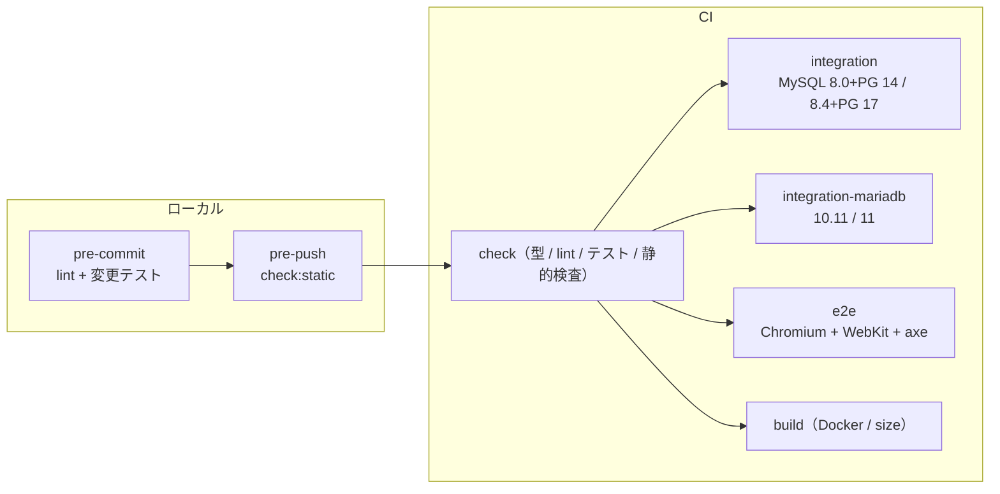

テストの層は下から: ユニット（`sql/split`、DDL スナップショット、web の純粋関数）→ **conformance**（実 DB、両方言で同一スイート）→ API 統合（実 DB、ルート単位）→ E2E（Playwright、機能 / a11y / ビジュアル）。

## 9. 逆引き: どこを変更するか

| やりたいこと | 触る場所 | 併せて必要なこと |
|---|---|---|
| API に項目を足す | `packages/shared/src/schemas/*` → `apps/api/src/routes/*` → web | Zod を先に定義。web は `hc<AppType>` 経由 |
| アダプターにメソッドを追加 | `types.ts` → `base.ts` / `mysql/*` / `postgres/*` | `ADAPTER_METHOD_NAMES` と conformance の `describe`、両方言で通す |
| DDL 操作を追加 | `packages/shared/src/schemas/ddl.ts` → `*/ddl.ts` → web のフォーム | `test/ddl.test.ts` の `SAMPLE_OPS` に両方言のスナップショット、プレビュー経由の UI |
| 画面の文言を変える | `config/locales/ja.ts` と `en.ts` | 直書き禁止。`dark:` 対応も必須 |
| 環境変数を追加 | `apps/api/src/config.ts` | `.env.example` と `docs/deployment.md` の表を同時に更新 |
| 新しい型のサポート | `docker/fixtures/*` → `*/values.ts` → conformance | `bun run db:reset`、両方言の `typesRow1` |

詳細な手順とチェックリストは [CLAUDE.md](../CLAUDE.md)（Compact Instructions）と `.claude/rules/` にあります。
