# アーキテクチャ

このコードベースを初めて触る開発者向けに、**どこに何があり、なぜそうなっているか**を説明します。運用は [deployment.md](deployment.md) / [operations.md](operations.md)、利用者向けは [user-guide.md](user-guide.md)、変更時に必ず守る規約は [CLAUDE.md](../CLAUDE.md) と `.claude/rules/` にあります。

## 1. 全体像

tsmyadmin は **1 プロセス**です。Bun 上の Hono が API を提供し、同じプロセスがビルド済み SPA を配信します。データベースは接続先として外部にあり、tsmyadmin 自身が持つ永続データはセッションストアだけです。

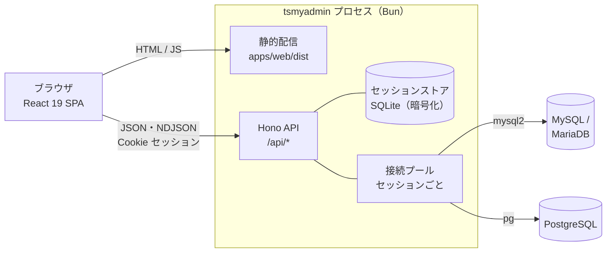

**なぜ 1 プロセスか** — 管理ツールは接続先ごとに資格情報を預かります。ブラウザに資格情報を持たせず、サーバー側セッションに閉じ込めるのが phpMyAdmin 以来の前提で、そのためには API が必要です。SPA を別ホストに置くと CORS と Cookie の設定が増えるだけなので、同一オリジンで配信します。

## 2. パッケージ構成と依存の向き

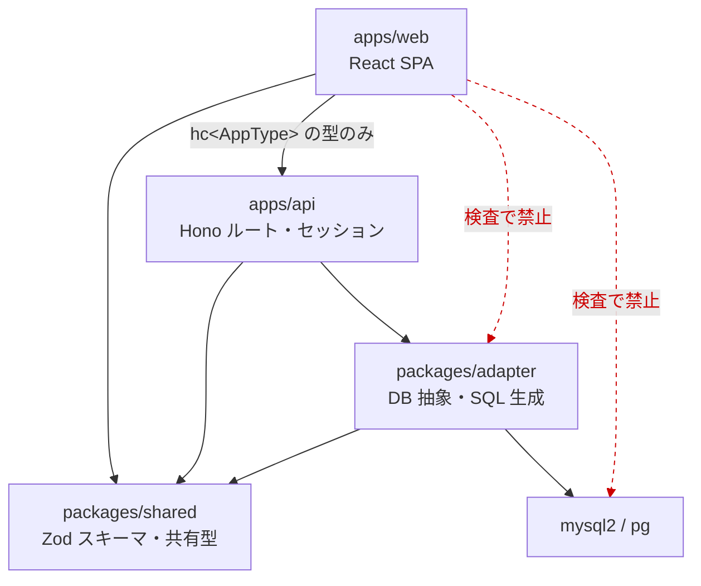

この向きは `scripts/check-architecture.mjs` が機械的に検査します（web からアダプターや DB ドライバーを import すると CI が落ちます）。`packages/shared` は他の内部パッケージに依存しません。

| 層 | 責務 | 触ってよい範囲 |
|---|---|---|
| `packages/shared` | Zod スキーマ = API の契約、共有型（`Cell`、`Namespace`、`DdlOp`…）、CSV の読み書き | 依存なし |
| `packages/adapter` | `DatabaseAdapter` 契約と MySQL / PostgreSQL 実装、SQL 生成、値のワイヤー変換 | `mysql2` / `pg` はここだけ |
| `apps/api` | HTTP、セッション、監査ログ、エクスポート / インポートの組み立て | アダプター経由でのみ DB へ |
| `apps/web` | 画面。`hc<AppType>` の型でのみ API を呼ぶ | サーバー実装は型しか見ない |

用語: **`hc<AppType>`** は Hono の RPC クライアント（`hono/client` の `hc`）で、`AppType` は `apps/api/src/app.ts` が export するルート定義の型です。パス・パスパラメータ・リクエストボディに型が効きます（レスポンスの型は下の「逆引き」の例を参照）。**`Namespace`** は `{ database, schema? }` で、`schema` を持つのは PostgreSQL だけです。

## 3. アダプター層

**なぜ ORM を使わないか** — 接続先のスキーマが分かるのは実行時です（利用者が任意のデータベースを開く）。コンパイル時にスキーマを固定する ORM（Prisma など）は前提が合いません。必要なのは方言ごとの SQL 生成・カタログ問い合わせ・値のワイヤー変換だけで、それをドライバー（`mysql2` / `pg`）の上に薄く置いたのが `packages/adapter` です。

方言差を 1 か所に閉じ込めるのがこの層の目的です。`base.ts` は方言非依存のロジック（キーセット走査、行キー解決、実行と結果整形、キャンセル管理）を持ち、方言固有の SQL は `mysql/` と `postgres/` にだけ置きます。

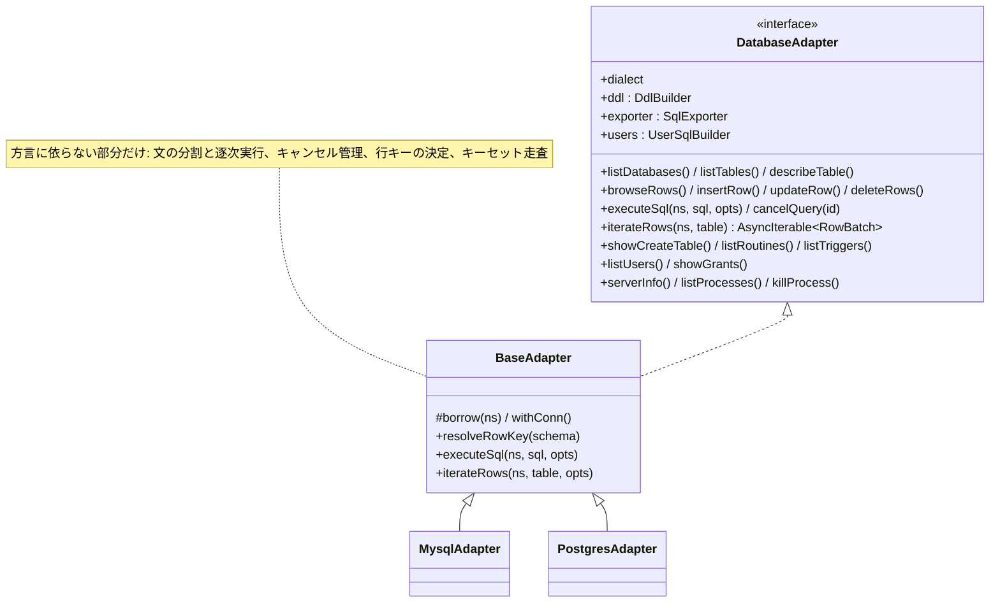

- **契約の同一性は conformance テストが保証します。** `packages/adapter/src/test/conformance.ts` は 1 つのスイートを MySQL と PostgreSQL の両方に対して実行します。`ADAPTER_METHOD_NAMES` に載ったメソッドすべてに `describe('<method>')` があることは `test/spec-consistency.test.ts` が検査するので、載せた時点で自動的に両方言のテストになります。
- **SQL の組み立て**: 識別子は `quoteIdent` / `quoteTable`、値は `Params` のプレースホルダ。文字列補間が許されるファイルは `scripts/check-sql-safety.mjs` の許可リストが唯一の正です。
- **字句解析は 1 か所**: `sql/split.ts` が公開するのは `splitStatements` / `stripComments` / `stripLeadingComments` の 3 つで、文の分割・先頭コメント除去・監査ログのマスクはすべてこれを通ります。リテラル・コメント・方言差（`#` は MySQL のみ、PostgreSQL はブロックコメントが入れ子、`E'…'` のエスケープ、`$tag$`）を知っているのは内部の `scanToken` だけです。詳しくは下の「字句解析と文の分割」を参照。

### 字句解析と文の分割

`splitStatements` は入力を 1 度だけ走査して文に切ります。「SQL を `;` で split する」では済まない箇所が多いので、仕様は `test/split.test.ts` を正とします。

| 構文 | 扱い |
|---|---|
| 文字列・識別子リテラル | 方言ごとのエスケープを解釈（PostgreSQL の `E'…'`、`$tag$…$tag$`、MySQL の `\` エスケープ） |
| コメント | `--` / `/* */`（PostgreSQL は入れ子）/ `#`（MySQL のみ）。先頭コメントは行番号を保ったまま除去できる |
| `DELIMITER` | 行に単独で書かれたときだけ有効（mysqldump 互換）。状態は `state.delimiter` で呼び出し側に返る |
| ルーチン本体 | `BEGIN … END`、PostgreSQL の `BEGIN ATOMIC`、`CASE` の入れ子を数えて 1 文にまとめる |
| `COPY … FROM stdin` | 続くデータブロックを SQL として解釈せず、`\.` までを 1 つの塊として持つ（pg_dump の既定形式） |
| psql メタコマンド | `\restrict` は捨て、それ以外は文として残す（実行時に `UNSUPPORTED`） |
| `SET sql_mode` | MySQL の `NO_BACKSLASH_ESCAPES` を追跡し、以降のリテラル解釈を切り替える（`@saved` 変数・`REPLACE`・`CONCAT` 経由も） |
| 途中で終わるファイル | `state.unterminated` で「コメントや文字列の途中で終わった」ことを返す |

**なぜ 1 度しか走査しないか** — 64 MB のダンプを複数回トークン化するとイベントループが数百 ms 単位で止まり、他の利用者のリクエストが待たされます。インポートは分割済みの結果を `ExecuteOptions.statements` でアダプターに渡します。

### 値のワイヤー形式

行は `Cell[][]`（カラム名が重複する JOIN 結果のため配列）で運びます。精度を落とさないことが最優先です。

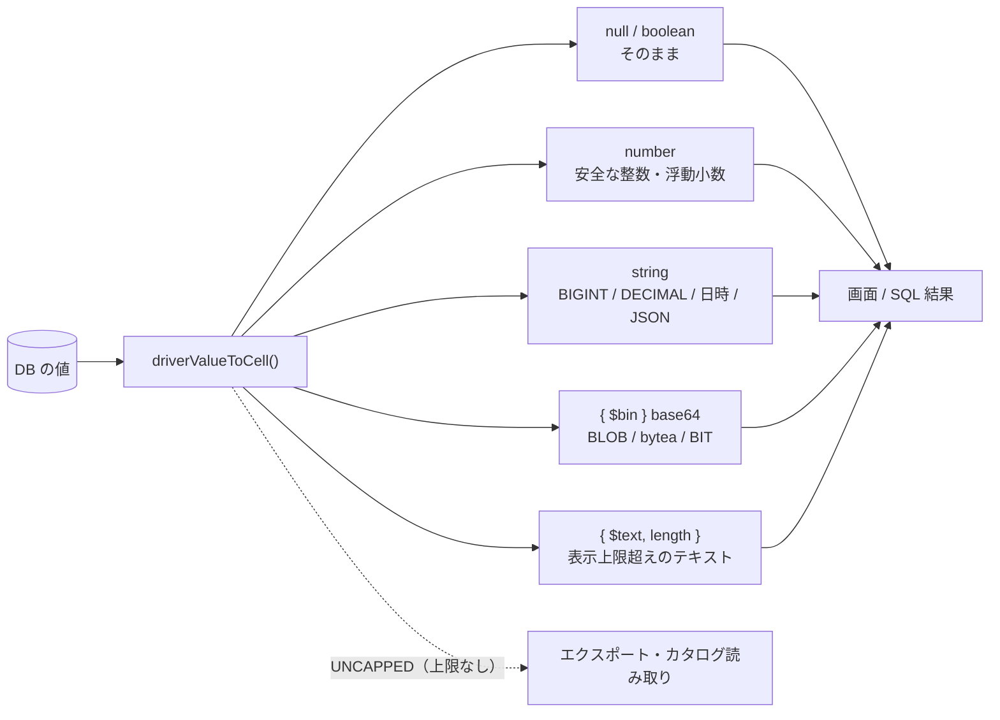

`{ $text }` は**表示専用**で、書き戻せません（`InputCell` 型が受け付けず、`toDbValue` も拒否します）。**なぜ書き戻せなくしているか** — 切り詰めた値を編集できる型にすると、利用者が気付かないまま末尾を失った値で UPDATE してしまうためです。エクスポートとカタログ読み取り（ビュー定義、`SHOW CREATE`）は上限なし（`base.ts` の `UNCAPPED`）で全文を取得します。

行キーの決め方も `base.ts` にあります（`resolveRowKey`）。主キー → NOT NULL な一意インデックス → PostgreSQL は `ctid` / MySQL は全カラム一致、の順です。ビュー・シーケンス、およびパーティションや継承の親テーブルは `none`（編集不可）になります — `ctid` は 1 つの物理リレーションの中でしか一意ではなく、親テーブルでは子ごとに重複するためです。

## 4. セッションと接続プール

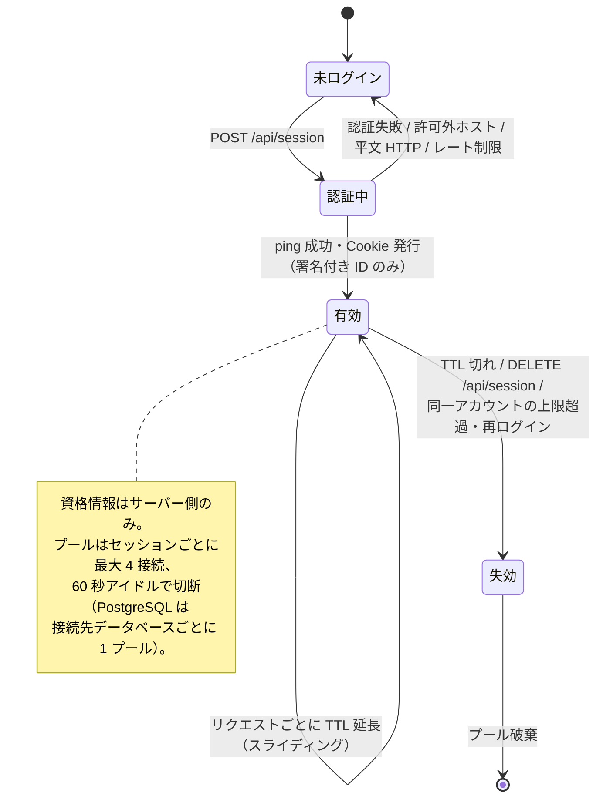

Cookie には署名付きセッション ID しか入りません。資格情報は `apps/api/src/session/store.ts`（メモリ）または `sqlite-store.ts`（`SESSION_SECRET` 由来の鍵で暗号化）にだけ置きます。

## 5. リクエストの流れ

### 5.1 行の閲覧（ふつうの GET）

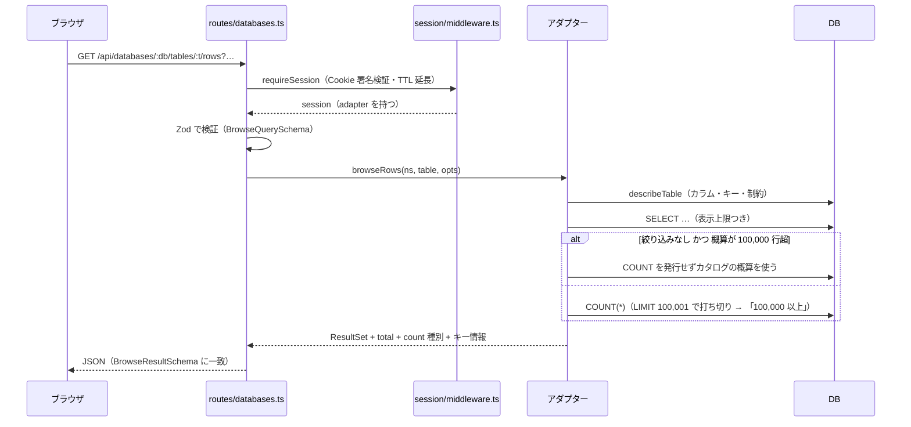

**なぜ件数を 100,000 で打ち切るか** — 絞り込みつきの `COUNT(*)` はインデックスが効かないと全表走査になり、巨大テーブルでは 1 ページ表示のたびに DB を占有します。phpMyAdmin と同じく上限で数え止め、「100,000 以上」として返します（絞り込みがなければカタログの概算で足ります）。件数の種類は `CountKind`（`exact` / `estimate` / `lower_bound`）で画面まで運びます。

### 5.2 SQL 実行（ストリーミングとキャンセル）

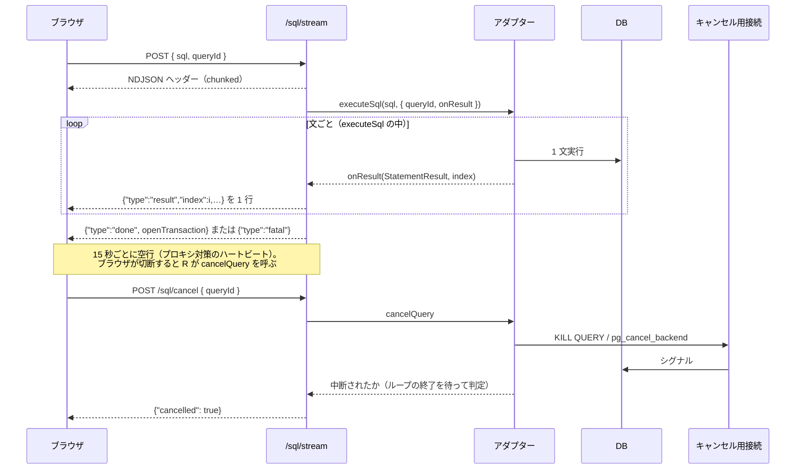

### 5.3 DDL とアカウント操作（プレビュー必須）

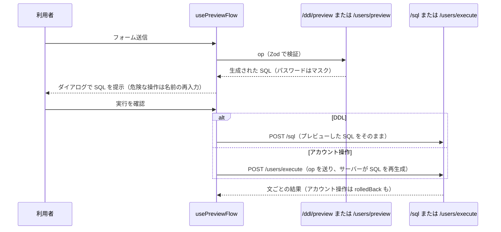

**プレビューを経ない実行 UI を作らないこと**が不変条件です（`.claude/rules/api-routes.md`）。

実行のしかたは 2 通りに分かれます。DDL はプレビューで見せた SQL をそのまま `/sql` に送ります（利用者が見た文と実行される文が同一であることを優先）。アカウント操作は SQL を送り返さず、`/users/execute` が `op` から組み立て直します — プレビューではパスワードを `****` にマスクしているので、そのまま送り返せる文が手元にないためです。

## 6. エクスポートとインポート

エクスポートは**ストリーミング**です。1 テーブルずつカタログを読み、500 行ずつ流します。ダンプを上から順に流し込めば復元できることが要件なので、セクションの並び順そのものが仕様です（親テーブル → 子テーブル、テーブル → 外部キー → ビュー、の順に依存を解いていきます）。

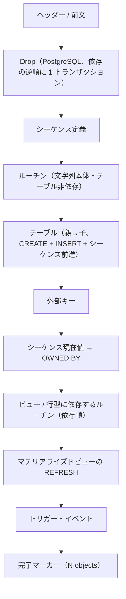

インポートは 1 回だけ字句解析し、ラッパー文を前後に足して 1 スクリプトとして実行します。

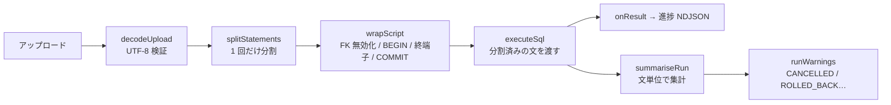

**なぜ 1 回だけ分割するか** — 64 MB のダンプを複数回トークン化するとイベントループが数百 ms 単位で止まり、他の利用者のリクエストが待たされるためです（`ExecuteOptions.statements` で分割結果をアダプターに渡します）。

## 7. 画面側

- ルーティングは TanStack Router（`apps/web/src/routes`、`routeTree.gen.ts` は生成物）。サーバー状態は TanStack Query が唯一の持ち主で、**サーバーのデータをローカル state にコピーしません**。
- `features/*` は互いを直接 import しません（共有は `components/` と `lib/`）。
- UI 文字列は `config/locales/{ja,en}.ts` にのみ置き、`locale.*` で参照します。`en.ts` は `satisfies Locale` で日本語版と同じ形であることが型で保証されます。
- 表示言語は「利用者の選択 → ブラウザ言語 → 日本語」の順に決まり、切り替え時はページを再読み込みします（各モジュールが読み込み時に一度だけ `locale` を読むため）。

## 8. 品質ゲート

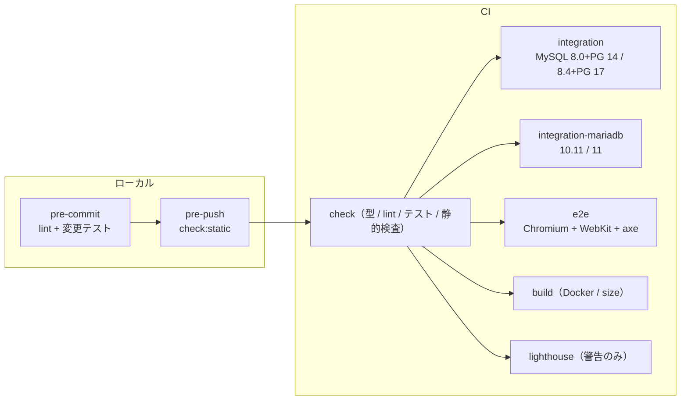

テストの層は下から: ユニット（`sql/split`、DDL スナップショット、web の純粋関数）→ **conformance**（実 DB、両方言で同一スイート）→ API 統合（実 DB、ルート単位）→ E2E（Playwright、機能 / a11y / ビジュアル）。

## 9. 逆引き: どこを変更するか

| やりたいこと | 触る場所 | 併せて必要なこと |
|---|---|---|
| API に項目を足す | `packages/shared/src/schemas/*` → `apps/api/src/routes/*` → web | Zod を先に定義。web は `hc<AppType>` 経由 |
| アダプターにメソッドを追加 | `types.ts` → `base.ts` / `mysql/*` / `postgres/*` | `ADAPTER_METHOD_NAMES` と conformance の `describe`、両方言で通す。`testing/fake-adapter.ts` に実装し、`apps/api/src/lib/audit.ts` の `AUDITED_METHODS`（データ・構造・アカウント・サーバー状態を変えるもの）か `PASSTHROUGH_METHODS` に分類する（`audit.test.ts` が網羅性を検査） |
| DDL 操作を追加 | `packages/shared/src/schemas/ddl.ts` → `*/ddl.ts` → web のフォーム | `test/ddl.test.ts` の `SAMPLE_OPS` に両方言のスナップショット、プレビュー経由の UI |
| 画面の文言を変える | `config/locales/ja.ts` と `en.ts` | 両方に同じキーを足す（`locale.test.ts` が形の一致を検査）。コンポーネントへの直書きは禁止 |
| 表示言語を追加する | `config/locale.ts` の `LOCALES` / `LOCALE_NAMES` / `LocaleCodeSchema` と `locales/<code>.ts` | `ja.ts` が型の出どころ。新しい表は `satisfies Locale` を付ける |
| 色・見た目を変える | Tailwind のクラス | `dark:` 対応を必ず付ける |
| 環境変数を追加 | `apps/api/src/config.ts` | `.env.example` と `docs/deployment.md` の表を同時に更新 |
| 新しい型のサポート | `docker/fixtures/*` → `*/values.ts` → conformance | `bun run db:reset`、両方言の `typesRow1` |

### 例: `GET /api/server/info` のレスポンスに項目を足す

型がどこからどこへ流れるかは、一度手を動かすのが早いです。`ServerInfo` に `timezone` を足す場合:

1. `packages/shared/src/schemas/server.ts` の `ServerInfoSchema` に `timezone: z.string().nullable()` を足す（契約はここが唯一の正）
2. `packages/adapter/src/{mysql,postgres}/server.ts` の `serverInfo()` が返す値に足す。戻り値の型は shared から来ているので、**片方だけだと typecheck が落ちます**
3. `packages/adapter/src/test/conformance.ts` の `describe('serverInfo')` に両方言の検証を足し、`testing/fake-adapter.ts`（API テストが使うインメモリ実装）にも値を入れる
4. `apps/api/src/routes/server.ts` は変更不要 — ルートはアダプターの戻り値をそのまま返し、**レスポンスを実行時に検証しません**。形を守るのは `apps/api/src/app.test.ts` の `ServerInfoSchema.parse(...)` です
5. `apps/web`: `lib/queries.ts` が `unwrap<ServerInfo>` のように shared の型を明示しています（`hc` の型が効くのはパス・パラメータ・ボディまでで、レスポンスは `unwrap<T>` に渡した型になります）。表示側と `config/locales/{ja,en}.ts` のラベルを足す
6. `bun run check` → `bun run db:up && bun run test:integration`

詳細な手順とチェックリストは [CLAUDE.md](../CLAUDE.md)（Compact Instructions）と `.claude/rules/` にあります。
