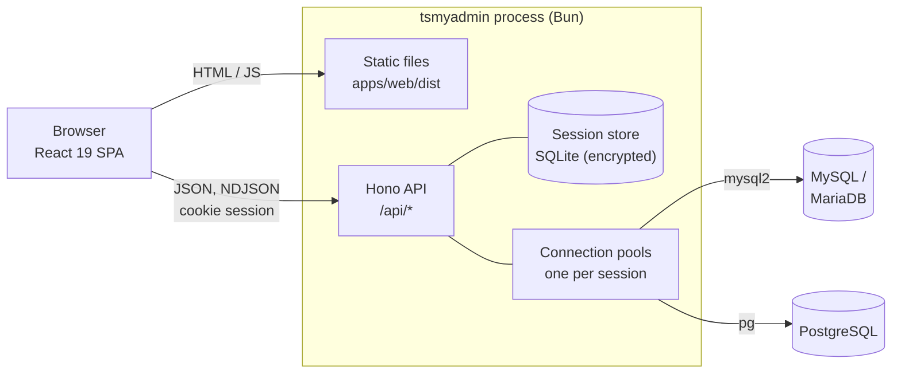
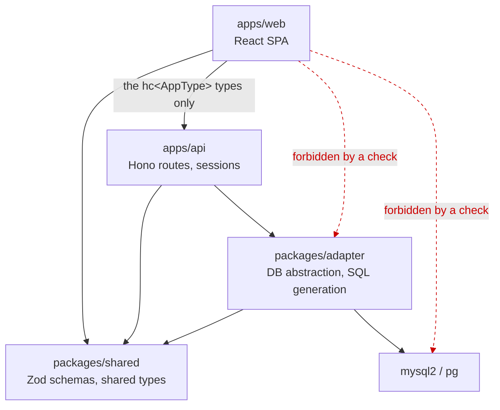
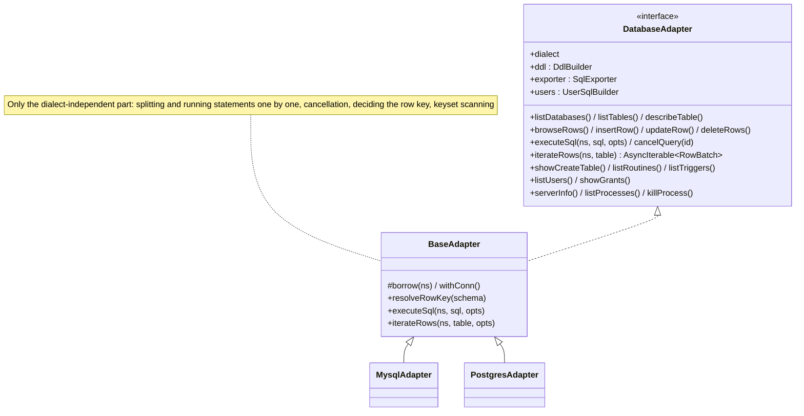
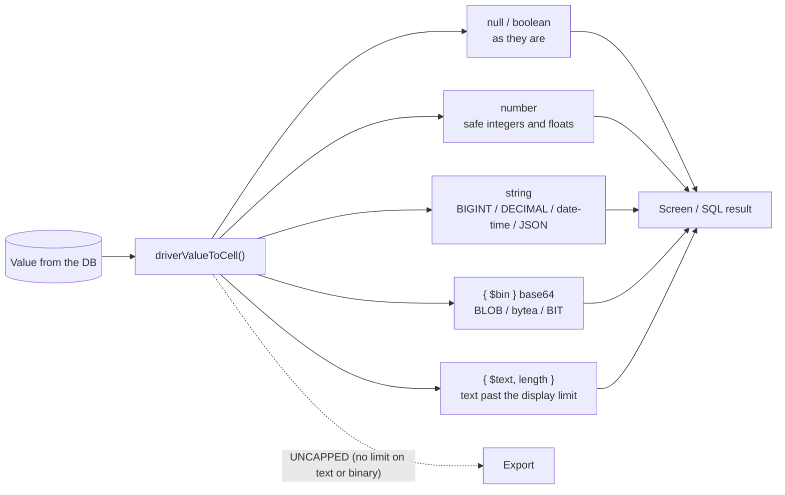
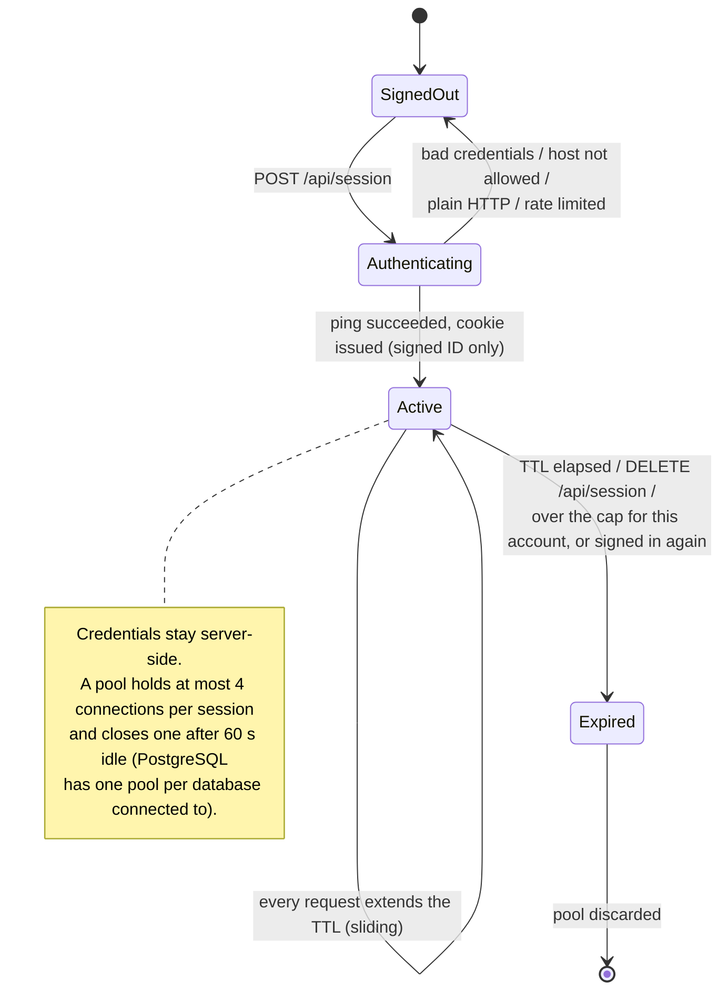
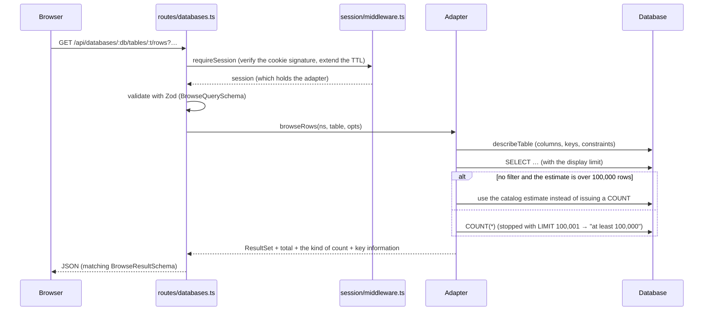
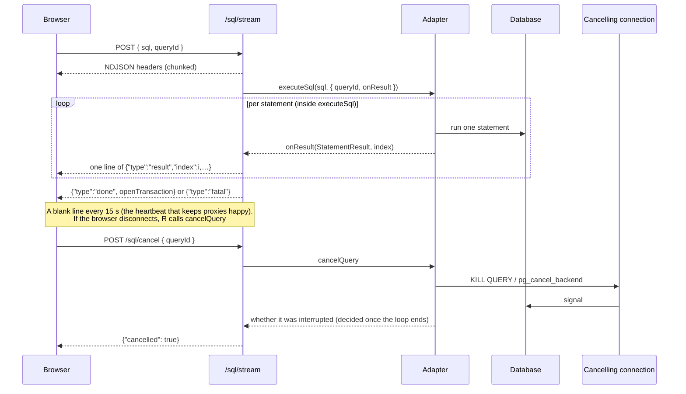
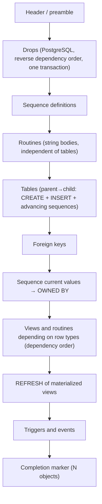
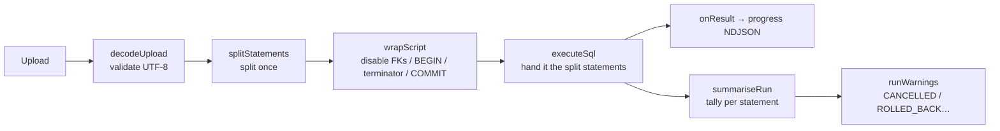
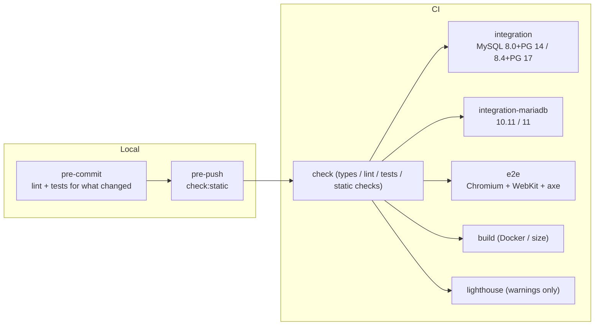

<!-- translated-from: docs/architecture.md sha256:4952abd1122db844370c6c255b272d450a58f765bda70f887b75de9732eed5b3 -->

# Architecture

*日本語版: [docs/architecture.md](../architecture.md)*

For a developer meeting this codebase for the first time: **where everything is, and why it is that way.** Running it is covered by [deployment.md](deployment.md) and [operations.md](operations.md), using it by [user-guide.md](user-guide.md), and the conventions every change must keep by [CLAUDE.md](../../CLAUDE.md) and `.claude/rules/` (Japanese).

## 1. The whole picture

tsmyadmin is **one process**. Hono on Bun serves the API, and the same process serves the built SPA. The databases live outside it as connection targets, and the only data tsmyadmin itself keeps is the session store.



**Why one process** — an administration tool is entrusted with credentials for each target. Keeping those out of the browser and confined to a server-side session has been the premise since phpMyAdmin, and that requires an API. Putting the SPA on a separate host would only add CORS and cookie configuration, so it is served from the same origin.

## 2. The packages and which way dependencies point



The **forbidden directions** are checked mechanically by `scripts/check-architecture.mjs`: importing the adapter or a database driver from the web app, touching a driver directly from a route, or making `packages/shared` depend on another internal package all fail CI. That web → api carries types only is a convention, not a check. `packages/shared` depends on no other internal package.

| Layer | Responsibility | What it may touch |
|---|---|---|
| `packages/shared` | The Zod schemas that *are* the API contract, the shared types (`Cell`, `Namespace`, `DdlOp` …), reading and writing CSV | Nothing |
| `packages/adapter` | The `DatabaseAdapter` contract and its MySQL and PostgreSQL implementations, SQL generation, converting values for the wire | `mysql2` and `pg`, here and nowhere else |
| `apps/api` | HTTP, sessions, the audit log, assembling exports and imports | The database, through the adapter only |
| `apps/web` | The screens. Calls the API only through the `hc<AppType>` types | Sees nothing of the server but its types |

Terms: **`hc<AppType>`** is Hono's RPC client (`hc` from `hono/client`), where `AppType` is the type of the route definitions exported by `apps/api/src/app.ts`. It types the path, the path parameters and the request body (for response types, see the worked example under *Where to change what*). **`Namespace`** is `{ database, schema? }`, and only PostgreSQL has a `schema`.

## 3. The adapter layer

**Why there is no ORM** — the target's schema is known only at run time, because the user opens whatever database they like. An ORM that fixes the schema at compile time (Prisma and its kind) does not match that premise. What is actually needed is per-dialect SQL generation, catalog queries and wire conversion of values, and `packages/adapter` is exactly that, laid thinly over the drivers (`mysql2`, `pg`).

The point of this layer is to confine the dialect differences to one place. `base.ts` holds the dialect-independent logic (keyset scanning, resolving a row key, running statements and shaping results, managing cancellation), and dialect-specific SQL lives only in `mysql/` and `postgres/`.



- **The conformance suite is what guarantees the contract is the same.** `packages/adapter/src/test/conformance.ts` runs one suite against both MySQL and PostgreSQL. `test/spec-consistency.test.ts` checks that every method listed in `ADAPTER_METHOD_NAMES` has a `describe('<method>')`, so listing a method makes it tested on both dialects automatically.
- **Building SQL**: identifiers go through `quoteIdent` / `quoteTable`, values through `Params` placeholders. The allowlist in `scripts/check-sql-safety.mjs` is the authority on which files may interpolate strings at all.
- **Lexing happens in one place**: `sql/split.ts` exports four things — `splitStatements`, `stripComments`, `stripLeadingComments` and `setAssignments` (which pulls the assignments out of a MySQL `SET`, used to decide autocommit during an import) — and splitting statements, stripping leading comments and masking the audit log all go through them. Only the internal `scanToken` knows about literals, comments and the dialect differences (`#` is MySQL only; PostgreSQL nests block comments, has `E'…'` escapes and `$tag$`). Deciding whether a statement reads (`stripLiterals` in `base.ts`) and matching passwords for the audit log use separate regular expressions, for speed. See *Lexing and splitting statements* below.

### Lexing and splitting statements

`splitStatements` scans the input once and cuts it into statements. Too much of this is not "split SQL on `;`", so `test/split.test.ts` is the specification.

| Construct | How it is handled |
|---|---|
| String and identifier literals | Each dialect's escapes are interpreted (PostgreSQL `E'…'` and `$tag$…$tag$`, MySQL `\` escapes) |
| Comments | `--`, `/* */` (nested on PostgreSQL) and `#` (MySQL only). Leading comments can be stripped while keeping the line numbers |
| `DELIMITER` | Honoured only when it stands alone on a line (mysqldump compatible). The state is handed back to the caller as `state.delimiter` |
| Routine bodies | PostgreSQL's `BEGIN ATOMIC … END` counts the inner `CASE … END` and keeps the whole thing as one statement. Other bodies are held together by their delimiter (`DELIMITER` on MySQL, `$$` for plpgsql). A bare `BEGIN … END` is not counted |
| `COPY … FROM stdin` | The data block that follows is not read as SQL: everything up to `\.` is kept as one chunk (pg_dump's default form) |
| psql meta-commands | `\restrict` and `\unrestrict` are discarded; the rest are kept as statements and fail with `UNSUPPORTED` when run |
| `SET sql_mode` | MySQL's `NO_BACKSLASH_ESCAPES` is tracked and switches how later literals are read (including through a `@saved` variable, `REPLACE` and `CONCAT`) |
| A file that stops mid-way | `state.unterminated` reports that it ended inside a comment or a string |

**Why it scans only once** — tokenising a 64 MB dump several times stalls the event loop for hundreds of milliseconds at a time, which makes other users wait. An import hands the already-split result to the adapter through `ExecuteOptions.statements`.

### How values go over the wire

Rows travel as `Cell[][]` — arrays, because a JOIN result can repeat a column name. Not losing precision comes first.



`{ $text }` is **for display only** and cannot be written back (the `InputCell` type does not accept it, and `toDbValue` refuses it). **Why it is made unwritable** — if a truncated value had an editable type, a user could UPDATE with a value whose tail had silently been cut off. The text limit applies only to the display path (browsing rows and running SQL), which is the only place that passes `DISPLAY`. Reading the catalog (view definitions, routine bodies, `SHOW CREATE`) is unlimited by default, and an export is `UNCAPPED` — no limit on text or binary.

Deciding the row key also lives in `base.ts` (`resolveRowKey`): primary key, then a NOT NULL unique index, then `ctid` on PostgreSQL or every column on MySQL. Views, sequences and the parent tables of partitioning or inheritance come out as `none` (not editable) — `ctid` is unique only within one physical relation and repeats across the children of a parent.

## 4. Sessions and connection pools



The cookie holds nothing but a signed session ID. Credentials live only in `apps/api/src/session/store.ts` (in memory) or `sqlite-store.ts` (encrypted with a key derived from `SESSION_SECRET`).

## 5. The path of a request

### 5.1 Browsing rows (an ordinary GET)



**Why the count stops at 100,000** — a filtered `COUNT(*)` with no usable index becomes a full scan, which would tie the database up every time a page is shown on a huge table. As phpMyAdmin does, counting stops at the cap and reports "at least 100,000" (with no filter, the catalog's estimate is enough). The kind of count travels to the screen as `CountKind` (`exact` / `estimate` / `lower_bound`).

### 5.2 Running SQL (streaming and cancellation)



### 5.3 DDL and account operations (a preview is mandatory)

```mermaid
sequenceDiagram
  participant U as User
  participant W as usePreviewFlow
  participant P as /ddl/preview or /users/preview
  participant E as /sql or /users/execute

  U->>W: submits the form
  W->>P: the op (validated by Zod)
  P-->>W: the generated SQL (passwords masked)
  W-->>U: shows the SQL in a dialog (dangerous operations ask for the name again)
  U->>W: confirms
  alt DDL
    W->>E: POST /sql (exactly the SQL that was previewed)
  else account operation
    W->>E: POST /users/execute (sends the op; the server regenerates the SQL)
  end
  E-->>W: a result per statement (account operations also report rolledBack)
```

**Never build a UI that runs without a preview** — that is an invariant (`.claude/rules/api-routes.md`).

How it runs then splits in two. DDL sends the SQL that was previewed straight to `/sql`, so that what the user read and what runs are the same text. An account operation sends no SQL back: `/users/execute` rebuilds it from the `op`, because the preview masked the password as `****` and there is no statement on hand that could be sent back as it is.

## 6. Export and import

Exporting **streams**. It reads the catalog one table at a time and sends 500 rows at a time. The requirement is that pouring the dump in from the top restores it, so the order of the sections is itself part of the specification (parent tables before children; tables, then foreign keys, then views — unwinding the dependencies as it goes).



Importing lexes once, adds wrapper statements around the script and runs the whole thing as one.



**Why it splits only once** — tokenising a 64 MB dump several times stalls the event loop for hundreds of milliseconds at a time, which makes other users wait (`ExecuteOptions.statements` hands the split result to the adapter).

## 7. The web app

- Routing is TanStack Router (`apps/web/src/routes`; `routeTree.gen.ts` is generated). TanStack Query is the sole owner of server state. A form copies query values once as its initial state but **never re-synchronises them with `useEffect`** — when the subject changes, it is rebuilt with the state-from-props pattern.
- `features/*` never import each other; sharing goes through `components/` and `lib/`.
- UI strings live only in `config/locales/{ja,en}.ts` and are read through `locale.*`. `satisfies Locale` on `en.ts` makes the type system guarantee it has the same shape as the Japanese one.
- The language is decided in the order "the user's choice → the browser's language → Japanese", and switching reloads the page (each module reads `locale` once, when it is loaded).

## 8. Quality gates



The test layers, from the bottom: unit (`sql/split`, the DDL snapshots, the pure functions of the web app) → **conformance** (real databases, one suite on both dialects) → API integration (real databases, per route) → E2E (Playwright: functional, a11y, visual).

## 9. Where to change what

| What you want to do | Where | What else it needs |
|---|---|---|
| Add a field to the API | `packages/shared/src/schemas/*` → `apps/api/src/routes/*` → web | Define the Zod schema first. The web app goes through `hc<AppType>` |
| Add a method to the adapter | `types.ts` → `base.ts` / `mysql/*` / `postgres/*` | Add it to `ADAPTER_METHOD_NAMES` and to the conformance `describe`, and make it pass on both dialects. Implement it in `testing/fake-adapter.ts`, and classify it in `apps/api/src/lib/audit.ts` as either `AUDITED_METHODS` (anything that changes data, structure, an account or server state) or `PASSTHROUGH_METHODS` (`audit.test.ts` checks that every method is in one of them) |
| Add a DDL operation | `packages/shared/src/schemas/ddl.ts` → `*/ddl.ts` → the web form | Snapshots for both dialects in `SAMPLE_OPS` in `test/ddl.test.ts`, and a UI that goes through the preview |
| Change a UI string | `config/locales/ja.ts` and `en.ts` | Add the same key to both (`locale.test.ts` checks the shapes match). Writing it into a component is not allowed |
| Fix the documentation | `docs/*.md` (Japanese is the original) | Translate the matching file under `docs/en/` and re-stamp with `bun run docs:sync` (`bun run docs:i18n` checks they keep up) |
| Add an interface language | `LOCALES` / `LOCALE_NAMES` / `LocaleCodeSchema` in `config/locale.ts`, and `locales/<code>.ts` | `ja.ts` is where the type comes from. Give a new table `satisfies Locale` |
| Change a colour or the look | Tailwind classes | Always include the `dark:` variant |
| Add an environment variable | `apps/api/src/config.ts` | Update `.env.example` and the table in `docs/deployment.md` at the same time (and its translation; `bun run docs:i18n` checks it) |
| Support a new type | `docker/fixtures/*` → `*/values.ts` → conformance | `bun run db:reset`, and `typesRow1` on both dialects |

### Example: adding a field to the `GET /api/server/info` response

Working through it once is the quickest way to see where the types flow. To add `timezone` to `ServerInfo`:

1. Add `timezone: z.string().nullable()` to `ServerInfoSchema` in `packages/shared/src/schemas/server.ts` (the contract lives here and nowhere else)
2. Add the value to what `serverInfo()` returns in `packages/adapter/src/{mysql,postgres}/server.ts`. The return type comes from shared, so **doing only one of them fails the typecheck**
3. Add assertions for both dialects to `describe('serverInfo')` in `packages/adapter/src/test/conformance.ts`, and give the value to `testing/fake-adapter.ts` (the in-memory implementation the API tests use)
4. `apps/api/src/routes/server.ts` needs no change — the route returns what the adapter gave it and **does not validate the response at run time**. What holds the shape is `ServerInfoSchema.parse(...)` in `apps/api/src/app.test.ts`
5. `apps/web`: `lib/queries.ts` names the shared type explicitly, as in `unwrap<ServerInfo>` (the `hc` types cover the path, the parameters and the body; the response is whatever type was passed to `unwrap<T>`). Add the display and the labels in `config/locales/{ja,en}.ts`
6. `bun run check`, then `bun run db:up && bun run test:integration`

The step-by-step rules and checklists are in [CLAUDE.md](../../CLAUDE.md) (Compact Instructions) and `.claude/rules/`, in Japanese.
